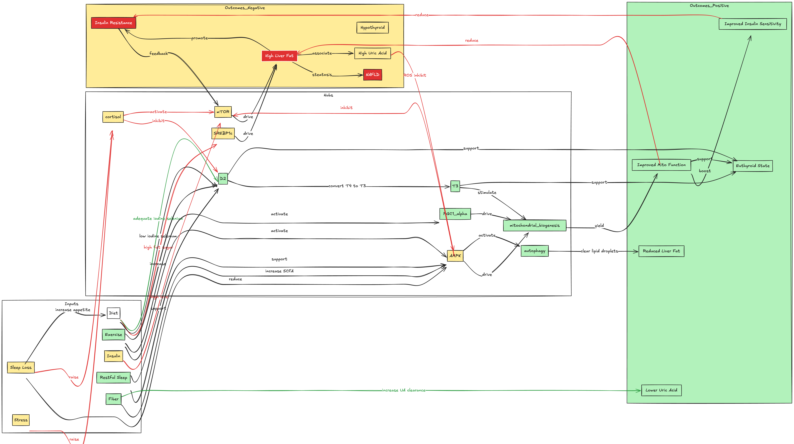

# Pathways for Up and Down Regulation of Metabolic Health

## 1. Key molecular hubs

| Hub                                         | Role                                                                                    |
| ------------------------------------------- | --------------------------------------------------------------------------------------- |
| **Mitochondrial biogenesis**                | Generates capacity for β‑oxidation, TCA/ETC flux and ATP production                     |
| **AMP‑activated kinase**                    | Senses low energy (↑AMP/ATP), ↑fatty‐acid oxidation, ↓lipogenesis, ↑insulin sensitivity |
| **mTOR**                                    | Senses nutrient abundance, ↑lipogenesis, ↓autophagy                                     |
| **Type II deiodinase (D2)**                 | Converts T₄→T₃ in liver, fat and muscle, driving basal metabolic rate (BMR)             |
| **Xanthine oxidase**                        | Generates uric acid as end‐product of purine catabolism; high UA → oxidative stress     |
| **Pro‑inflammatory cytokines** (TNFα, IL‑6) | Promote insulin receptor (IR) serine‐phosphorylation → IR blockade                      |

---

## 2. Lifestyle & hormonal inputs

### A. Diet

* **High fructose/sugar, saturated fat**

  * ↑ De novo lipogenesis via SREBP‑1c
  * ↑ Purine breakdown → ↑ uric acid → mitochondrial ROS → ↓AMPK, ↑mTOR
  * Net effect: ↑NAFLD, ↑insulin resistance (IR), ↑hypothyroid symptoms (via ↓mitochondrial T3 activation)

* **Iodine, selenium, tyrosine, protein sufficiency**

  * Substrates/cofactors for thyroid‐hormone synthesis & D2 activity
  * ↑T₃ → ↑PGC‑1α → ↑mitochondrial biogenesis → ↑BMR, ↓hepatic fat, ↑insulin sensitivity

### B. Exercise

* **Acute & chronic aerobic + resistance**

  * ↑AMPK activation → ↑fatty‐acid oxidation, ↑GLUT4 translocation → ↓hepatic & muscle lipids, ↓IR
  * ↑PGC‑1α → ↑mitochondria & D2 expression → ↑local T₃ generation
  * Net effect: ❋→ protects against NAFLD, IR & supports euthyroid state

### C. Insulin

* **Elevated insulin (hyperinsulinemia)**

  * Chronic: ↑mTOR → ↑SREBP‑1c lipogenesis, ↓autophagy
  * Promotes hepatic steatosis & IR (vicious cycle)
* **Improved insulin sensitivity (via diet/exercise)**

  * ↓basal insulin → relieves mTOR, allows AMPK autophagy → ↓hepatic fat & inflammation

### D. Sleep

* **Sleep deprivation/fragmentation**

  * ↓Leptin, ↑Ghrelin → ↑appetite, ↑calorie intake (often high‐fructose)
  * ↓AMPK activity, ↑cortisol → ↑gluconeogenesis & IR
  * Net effect: ↑NAFLD, ↑IR, impaired thyroid feedback

* **Adequate restorative sleep**

  * Restores AMPK tone, normalizes HPA axis → supports insulin sensitivity & thyroid hormone activation

### E. Stress (HPA activation)

* **Chronic psychosocial/physiological stress**

  * ↑Cortisol → ↑gluconeogenesis, ↑visceral fat, ↑lipolysis in adipose → ↑free fatty acids delivered to liver
  * Cortisol antagonizes TSH release & D2 activity → relative hypothyroid state
  * ↑pro‑inflammatory cytokines → serine‑phosphorylate IR → IR

### F. Fiber (prebiotic & bulking)

* **High soluble & insoluble fiber**

  * ↑Short‐chain fatty acids (SCFAs) in gut → SCFA→AMPK in liver/muscle → ↑fat oxidation, ↓lipogenesis
  * Slows carbohydrate absorption → blunts post‑prandial insulin spikes → ↓mTOR activation
  * Enhances uric acid excretion via gut, ↓serum UA
  * Net effect: ❋→ protects vs. NAFLD, IR & hyperuricemia; supports thyroid by reducing inflammatory burden

---

## 3. Disease‐specific flows

### Hypothyroidism

* **Negative drivers**

  * Low dietary iodine/selenium → ↓T₃
  * Chronic stress/cortisol → ↓TSH & D2
  * Sedentary lifestyle → ↓PGC‑1α, ↓mitochondrial mass
* **Positive interventions**

  * Adequate micronutrients + exercise → ↑D2, ↑mitochondria
  * Improved sleep & stress management → restore HPT axis

### NAFLD & Insulin Resistance

* **Negative drivers**

  * High‐fructose / Processed food + hyperinsulinemia → ↑SREBP‑1c lipogenesis
  * ↑Uric acid → mitochondrial ROS → ↓AMPK → ↑lipogenesis
  * Chronic sleep loss & stress → ↑cortisol → FFA flux to liver
* **Positive interventions**

  * Exercise & fiber → ↑AMPK → ↑β‐oxidation, ↓lipogenesis
  * Lower insulin via low‑GI diet → ↓mTOR, ↑autophagy of lipid droplets

---

## **Advisory**

1. **Diet**: Emphasize low‑GI, moderate protein (including plant & lean animal for tyrosine), adequate iodine (iodized salt) & selenium (nuts, fish) while cutting back on fructose‑sweetened beverages.
2. **Exercise**: Daily moderate cardio (30 min) plus resistance sessions 3×/week to boost AMPK/PGC‑1α & D2.
3. **Insulin**: Aim for euglycemia via spaced meals, fiber‑rich carbs to blunt spikes, and weight loss to lower basal insulin.
4. **Sleep & Stress**: Target 7–8 h/night, use mindfulness or CBT techniques to keep cortisol in check, which also supports TSH/D2.
5. **Fiber**: ≥25 g/day (legumes, oats, psyllium) to enhance SCFA→AMPK, improve satiety, and increase uric acid clearance.

Together, these interventions “rewire” the map back toward high AMPK/mTOR balance, restored thyroid‐mitochondrial axis, lower uric acid, and resolution of NAFLD and insulin resistance.

[Take the quiz ](good_energy_quiz.html)